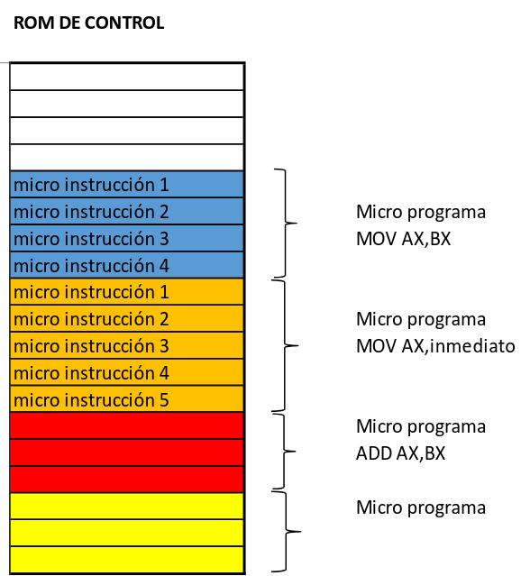

# Unidad 10 - Unidad De Control, CISC vs RISC y Modos de Direccionamiento
## Unidad de Control
Es la unidad encargada de la decodificacion e interpretacion de las instrucciones. 
### Rom De Control
Una rom ubicada dentro de la unidad de control que tiene tantos microprogramas como set de instrucciones dentro del procesador. Estos microprogramas estan formados por microinstrucciones las cuales son las encargadas de generar los unos y ceros en el Bus de control.
 

La fase de decodificacion consiste en apuntar al microprograma de acuerdo a la instruccion ingresada. Al terminar la ejecucion del microprograma de la instruccion, su ultima microinstruccion sera el salto al inicio del microprograma de la fase fetch. 

## CISC vs RISC 
El juego de instrucciones de la arquitectura IA-32 es de tipo CISC. Esto le da ciertas caracteristicas como que tenga un amplio repertorio de instrucciones, la complejidad esta en el tamaño variable de las instrucciones y las instrucciones e ejecutan en varios ciclos de reloj. 

La arquitectura RISC tiene como principal objetivo disponer de instrucciones muy simples con un numero muy reducido de microinstrucciones.

Las diferencias basicas entre ambas arquitecturas fundamentalmente pasa por la tecnologia RISC no esta conformada por una ROM de control y que tambien, en la tecnologia RISC, el tamaño de las instrucciones es fijo. 

## Modos de Direccionamiento
Un modo de direccionamiento hace referencia a la forma en la que se obtiene un operando al que hace referencia una instruccion de la maquina.
### Modo de Direccionamiento Inmediato
Un operando utiliza el modo de direccionamiento inmediato si esta escrito como una constante dentro de la instruccion. Se dice que el operando es el que esta contenido en el campo dato de una instruccion en codigo maquina. 
### Modo de Direccionamiento Directo
#### Directo por Memoria
Un operando utiliza el modo directo por memoria si esta ubicado en una memoria y la direccion de la memoria se especifica explicitamente en la instruccion o bien utilizando una variable. Ahora el campo de dato hace referencia a la direccion en memoria donde esta el operando. 
#### Directo por Registro
Un operando utiliza el modo directo por registro si está ubicado el registro interno del procesador. En estos casos, la referencia al registro que contiene el operando, esta indicado dentro del codigo de operacion. 
### Modo de Direccionamiento Indirecto
En este caso, el operando utiliza direccionamiento indirecto si esta ubicado en memoria y la direccion en memoria se especifica atraves de un registro. La locacion en memoria a acceder para obtener el operando esta dada por DS:[REGISTRO]
### Modo de Direccionamiento Relativo 
Un operando realiza direccionamiento relativo cuando la direccion de memoria se especifica utilizando sumas de registros y constantes. El formato es el siguiente: DS:[REGISTRO_BASE + REGISTRO_INDICE + VALOR_CONSTANTE]
Los registros base son BX y BP y los registros indice son SI y DI.