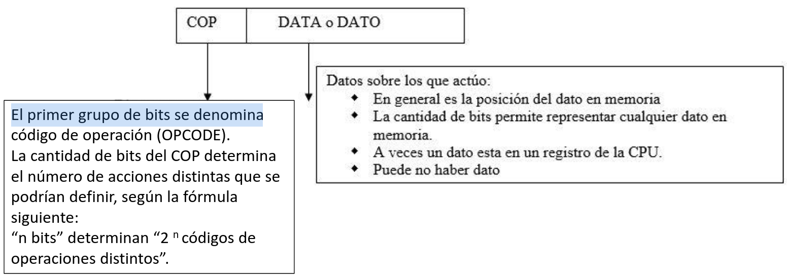
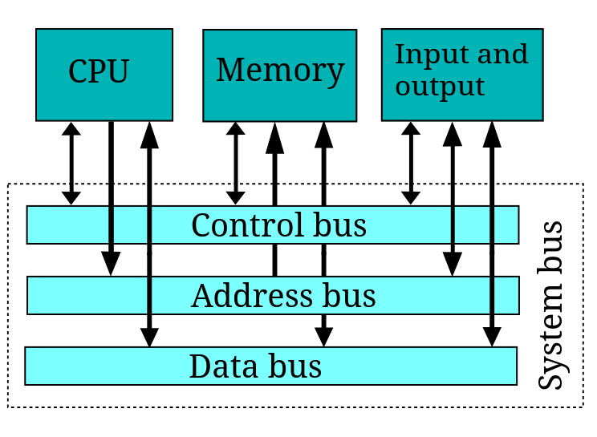

# Unidad 7 - Diseño de una Computadora Digital
### Modulo
Compuesto por una configuracion determinada de compuertas, un modulo es el encargado de **realizar una o varias operaciones** sobre datos codificados en binarios que se almacenan en **registros** asociados al modulo mientras se realiza la operacion.

Si dentro de un modulo, una operacion se aplica a un **registro**, esta se denomina **microoperacion** y se activa en **un instante de tiempo sincronizado por los pulsos de del reloj**.

## Registros en IA-32

### Registros de porposito general
Los cuatro registros de calculo diseñados para ser utilizados para operaciones aritmeticas y logicas son:
1. EAX - **Accumulator**
2. EBX - **Base**
3. ECX - **Counter**
4. EDX - **DATA**

AGREGADO:
La letra E delante del registro vienen de **"Extended"** y tiene con que estas accediendo a los 32 bits del registro. 
En el caso de que quieras acceder a 16 bits del registro se usa como siempre (AX, BX, CX, DX) y si se quiere acceder a 8bits se puede utilizar tanto AH BH CH DH para acceder a los 8 bits mas significativos como AL BL CL DL para los bits menos significativos. 
### Registros punteros
Los registros punteros tienen un tamaño por defecto de 32 bits con la posibilidad de usarlos como 16 bits para mantener la compatibilidad. Estos son:
1. IP [**Instruction Pointer**]: Es el registo encargado de apuntar a la proxima instruccion
2. SP [**Stack Pointer**]: Es un registro encargado de apuntar al final de la pila.
3. BP [**Base Pointer**]: Es el registro encargado de usarse para los accesos al stack.
4. SI [**Source Index**]: Este registro se encarga de apuntar a la direccion origen de una estructura cuando se realiza una operacion de copiado.
5. DI [**Destination Index**]: Este registro se encarga de apuntar a la direccion destino de una estructura cuando se realiza una operacion de copiado.

### Registros de segmento
Los registros de segmento tiene un tamaño fijo de 16 bits y sirven para apuntar al inicio de un segmento. 

## Segmentos
Los segmentos son **espacios en memoria de tamaño variable**, continuos que siguen un criterio de agrupacion. Es una forma de organizacion de la memoria logica. Los tipos de segmento que existen son: Segmento de Codigos, Segmento de datos o Segmento de pila. 
## Paginas
Las paginas, a diferencia de los segmentos, son espacios de memoria de tamaño fijo. En el modo Segmento Paginado siguen existiendo los segmentos, lo que cambia es que los segmentos ahora estan divididos por paginas. 

## Modo Real
El modo real tiene ciertas caracteristicas que lo diferencian de otros modos que son las siguientes:
1. Tiene 20 bits para el direccionamiento de memoria.
2. Trabaja unicamente en modo segmentado.
3. Tiene acceso directo el software a las rutinas de la BIOS y el hardware periferico.
4. Es monotarea y no tiene conceptos de proteccion de proteccion de memoria o multitarea a nivel hardware.
5. Una palabra es de 16 bits.
6. El rango de direcciones de un segmento va del 0000 a FFFF.
7. Cada direccion identifica identifica 8 bits de almacenamiento.
8. Incapaz de manejar memoria virtual.

## Modo protegido
El modo protegido, al igual que el modo real, tiene ciertas caracteristicas que lo distinguen de los demas. Estas son:
1. Existe la memoria virtual. Esto basicamente es disponer de un espacio de memoria convinada con la MP y generalmente almacenada en el disco duro para hacer creer al programador que dispone de una mayor capacidad de memoria principal. El microprocesador siempre accede la memoria principal por lo tanto si intenta acceder a un sector que no se encuentra en la memoria principal, es el OS el encargado de buscarlo en la memoria virtual y cargarlo en la memoria principal. La capidad maxima de memoria virtual es de hasta 64 TB. 
2. Trabaja con Memorias Principales de hasta 4GB, por lo tanto los buses de direcciones seran de 32 bits.
3. La memoria es segmentada, con o sin paginacion. Es decir puede ser segmentada o Segmento paginado. 
4. Proteccion de programas.
5. Capacidad de multitareas.
6. Posible conexion a memoria cache.

## Instrucciones
Cuando una computadora realiza una tarea compleja, a pedido del usuario, ejecuta una **serie de operaciones simples representados por un juego propio de instrucciones**. Este conjunto de instrucciones contituyen el **lenguaje maquina**. Para cumplir plasmar una tarea desdeada por el programador se utiliza un lenguaje simbolico que despues se combierte en lenguaje maquina.

Codigo de la Instruccion: Combinacion de bits que la unidad de control de la CPU interpreta para generar microoperaciones que permitan su ejecucion. 

Formato de la instruccion: El formato mas simple que existe es el que asigna un grupo de bits para representar una "accion" y otro grupo para representar el "dato" al que afecta esta accion. 

## Lenguaje de Alto Nivel Y Lenguaje Bajo Nivel
Programa: Conjunto ordenado de instrucciones que resuelven una tarea. 

Compiladores: Las herramientas que se encargan de la traduccion de un lenguaje de alto nivel a un lenguaje de bajo nivel. 

Interpretes: Herramientas que se encargan de la traduccion de sentencias de un lenguaje de alto nivel a bajo nivel en tiempo de ejecucion

### Assembler
Assebly surge como un lenguaje de bajo nivel con el objetivo de simplificar el trabajo con largas secuencias binarias a la hora de programar. Es importante mencionar que cada procesador tiene su propio assembler.

## Unidad Central de Procesamiento - CPU
Las funciones que cumple la CPU son:
1. Tratamiento de instrucciones: La unidad dentro de la CPU especializada para esto que es la unidad de control (**CU**) que se sincorniza con el clock.
2. Operaciones de los datos: La unidad dentro de la CPU especializada en esta tarea es la unidad aritmetico logica (**ALU**)
3. Calculo de direcciones de memoria: La unidad especializada en esta tarea es la unidad de manejo de memoria (**MMU**)

### Comunicacion con la Memoria Principal
La memoria principal esta conctada con la CPU atraves de tres busses:
1. **Bus de datos**: Es un camino bidirecional que permite la tranferencia de un grupo de bits desde o hacia la MP.
2. **Bus de direcciones**: Permite la comunicacion entre la MMU y la MP.
3. **Bus de control**: Permite enviar ordenes de lectura o de escritura hacia la memoria principal.

### Direccionamiento de la Memoria en Modo Real
Para poder acceder a un dato, es necesario tener la direccion fisica. Para lograr el objetivo de obtener la direccion fisica se debe realizar un calculo con la base del segmento y el desplazamiento. 
Direccion Fisica = Base del segmento x 10h + Desplazamiento

## Intrucciones basicas en assembly 
#### **MOV**
Permite la transferencia de datos de memoria, registros y acumulador.

Sintaxis: MOV (Destino), (Origen)
#### **ADD**
Suma dos operandos y guarda el resultado en el operando destino.

Sintaxis: ADD (Destino), (Origen)
## Ciclo de instruccion
El ciclo de instruccion se puede dividir en las etapas siguientes:
1. Busqueda de la instruccion en memoria. (**BI**)
2. Interpretacion del codigo de la instruccion. (**DEC**)
3. Busqueda del datos u operando afectado por la instruccion. (**BO**)
4. Generacion de ordenes al modulo que opera ese dato y actualizacion del IP. (**EJEC**)
