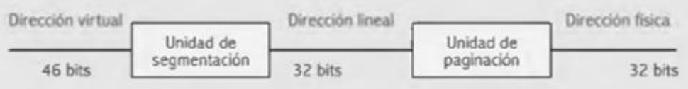
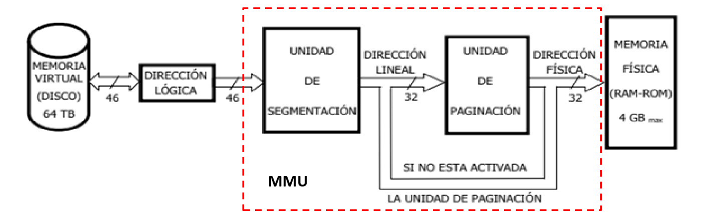
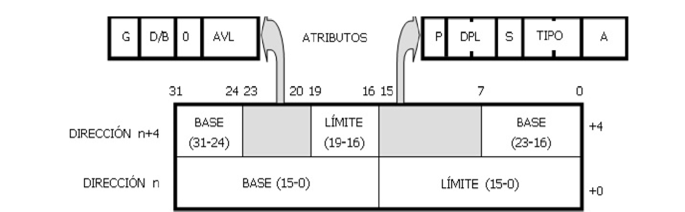
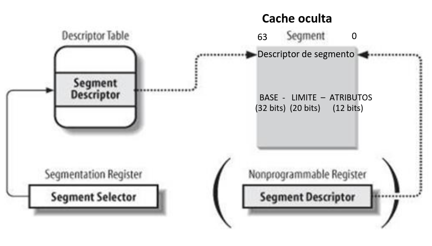
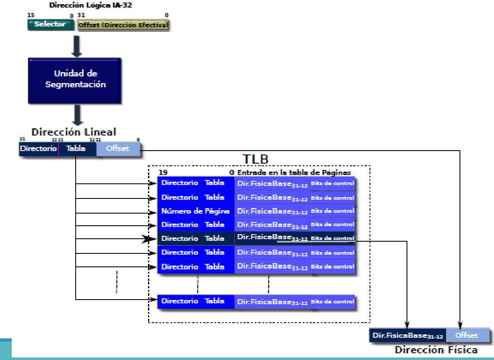

# Unidad 9 - Segmentación, Paginación y Memoria Cache
## Memoria Virtual
La memoria virutal es un metodo de organizacion y gestion de la memoria proporcionandole al programador de aplicaciones un esapacio mucho mayor del que dispone fisicamente. 

Direccion Virtual: Direccion logica perteneciente al espacio de direccionamiento virtual.

### Funcionamiento 
EL proceso que realiza la memoria es el siguiente:
1. Genera la direccion del objeto que necesita la cual se envia a la MMU
2. La MMU comprueba si el objetio se en la memoria principal:
    - Si se encuentra lo accede normalmente.
    - Si no lo encuentra lo comunica al Sistema Operativo 
3. Si no lo encontro el sistema operativo es el encargado de localizar el objeto en la memoria virtual y transferirlo a la memoria principal para que pueda ser utilizado. 

### Formas de organizar la memoria virtual
Las dos formas de organizar la memoria virtual son las siguientes:
- Segmentacion: Donde la memoria virtual se divide en segmentos de tamaño variable.
- Paginacion: Division del espacio de direcciones de cada proceso en bloques de tamaño uniforme llamado paginas.
## Segmentacion en Modo Protegido
Cuando la segmentacion esta activa, la memoria esta dividida en segmentos los cuales tienen una longitud variable que esta definida por el tamaño de ese segmento del programa. En esta forma de organizacion de la memoria la estructura del programa refleja su division logica. 

### Pasar de direccion logica a fisica 
Estando en modo protegido esto se consigue con un proceso de dos niveles:
- Traslacion de una direccion logica 
- Paginacion del espacio lineal 

Para realizar la tarea de traduccion, existe una unidad llamada MMU que internamente esta compuesta por dos unidades:
- La unidad de segmentacion que traduce de la direccion logica a una direccion lineal.  
- La unidad de paginacion que traduce la direccion lineal a la direccion fisica la cual se envia a la memoria fisica por el bus de direccion. 

Estos son los tipos de direcciones: 
1. Direccion Virtual (46 bits): Abarca toda la dimension de la memoria virtual y es el que maneja el programador de aplicaciones. Las direcciones se componen de un selector el cual selecciona un determinado segmento de la memoria virtual y desplazamiento que determina la pocision dentro del segmento. 
2. Direccion Lineal (32 bits): Permite referenciar a los 4 gb de memoria RAM disponible. Tiene dispuestas todas sus pocisiones en orden consecutivo o lineal.
3. Direccion Fisica (32 bits): Utilizada para acceder a las celdas de memoria RAM del sistema.

### Esquema de las unidades de la MMU

Los registros de segmento de 16 bits se transforman en selectores de tablas que contienen la direccion base, el limite y los atributos del segmento seleccionado. Esta estructura se denomina Descriptor de segmentos. 

Desplazamiento: El tamaño maximo que puede tener un segmento esta determinado por el campo limite del descriptor y el atributo de granularidad 

### Unidad de Segmentacion 
- Siempre esta activa.
- Traduce direcciones virtuales a lineales.
- El direccionamiento en el espacio logico se realiza atraves de un selector de segmento y desplazamiento.
- Las tablas puede contener hasta 8192 entradas de descriptores.
- Hay dos registros que indican el comienzo de las tablas GDTR y LDTR que proporcionan las direcciones de base de las tablas de descriptores de segmento.

### Tablas de Descriptores 
Existen dos tablas de descriptores que se utilizan con los registros de segmento:
- Tabla de Descriptores Globales: contienen definiciones de segmentos que se aplican a todos los programas. Otro nombre que tiene esta tabla es la de descriptor del sistema. 
- Tabla de Descriptores Locales: son por lo general unicos para una aplicacion. Otro nombre que tiene esta tabla es de descriptor de applicacion. 

Cada tabla posee 8192 descriptores con un total de 16 384 descriptores disponibles para una aplicacion en un momento dado. 

### Division del selector 
El registro segmento utilizado como selector esta compuesto por 3 campos:
- Indice (13 bits): es el numero de entrada en una tabla de descriptores de segmento.
- Indicador de tabla TI (1 bit): Define a la tabla que se accede. (0) para acceder a la GDT y (1) para acceder a la LDT.
- Nivel de privilegiio RPL (2 bits, menos significativos): Nivel de privilegio del peticionario, (0) nivel del sistema, (1) nivel del administrado, (2) nivel del programador, (3) nivel del usuario.

### Parametros que determinan un segmento
1. Base: Campo de 32 bits que contiene la direccion lineal donde comienza el segmento.
2. Limite: Campo de 20 bits que expresa el tamaño del segmento. Como son 20 bits el tamaño maximo es de 1MB, hay otro bit complementario en el campo de atributos, llamado de granularidad que indica si el limite esta expresado de bytes (G=0) o en paginas 4KB (G=1).
3. Atributo o derecho de acceso: campo de 12 bits, que proporciona la caracteristica mas relevante del segmento. 

### Tabla de descriptores de segmento
- Dentro del sistema hay dos tipos de tablas: GDT y LDT.
- La GDT es global y se usa para todo el sistema.
- La direccion base de la GDT se alamacena en los bits menos significativos del registro GDTR. EL GDTR esta compuesto por dos partes: La direccion base de la GDT y el limite de la misma.
- En el sistema puede haber mas de una LDT pero unicamente puede haber una activa.
- Las LDT estan descriptas en la GDT. 
- La direccion base de la LDT esta almacenada en el registro LDTR.
- El LDTR es un indice que apunta a una entrada de la GDT donde se obtiene la base y el limite de la LDT. 

#### Descriptor de Segmento 

Existen tres tipos de descriptores de segmento:
- Los de datos
- Los de codigo
- Los de tareas 
Estos contienen la direccion base y la direccion limite del segmento en el espacio de codigo.

#### Funcion de los bits del campo atributo
- Bit de presencia (P): Indica si el segmento al que referencia el descriptor esta cargado, o sea, se halla presente en la memoria principal (P=1) o ausente (P=0).
- Nivel de privilegio (DPL): Indica el nivel de privilegio del segmento al que refiere el descriptor. Su valor puede variar entre el 0 y el 3 y es un campo que consta de dos bits.
- Tipo de segmento (S): Si S=1, el segmento que corresponde al selector es "normal", o sea, es una segmento de codigo, pila o dato. Si S=0, se refiere a un segmento del sistema, que referencia a un recurso espacial del sistema. 
- Tipo: Los tres bits de este campo distinguen en los segmentos normales si se trata, de datos o de pila. Ademas, determina el acceso permitido de lectura, escritura o ejecucion. 
- Accedido (A): Este bit se pone automaticamente en uno cada vez que el procesador accede al segmento. 
- Granularidad (G): Los 20 bits del campo limite del descriptor indican el tamaño del segmento, que estara expresado en bytes si G=0 y en paginas de 4KB si G=1. 
- Defecto/Grande (D/F): En el segmento de codigo el bit D y en los segmentos de datos de este mismo bit llamado B, permiten distinguir los segmentos nativos de 32 bits del procesador. Si el D=1 tanto las direcciones efectivas como los operandos son de 32 bits. Si D=0 se toman solo 16. 
- Disponibilidad (AVL): Bit en  disposicion del usuario para poder diferenciar ciertos segmentos que contengan un tipo determinado de informacion o que cubran alguna funcion en especifico. 

### Traduccion de direcciones logicas a lineales 
1. El selector determina el tipo de tabla
2. Se selecciona el descriptor correspondiente al indice 
3. Para poder posicionarse en un descriptor de segmento se calcula así: 
    - Direccion = Base (LDTR o GDTR) + INDICE * 8
4. El 8 es por que se le agregan 3 ceros a los 13 bits del indice, esto es debido a que cada indice indica un descriptor pero cada descriptor ocupa 8 pocisiones en la memoria.
5. Se selecciona el descriptor correspondiente con la direccion.
6. A partir del descriptor se toma la base y se suma el desplazamiento.
7. Es necesario dos acceso a memoria

Intel agrega registros no programables que contienen los descriptores de segmentos. Esto permite que la traduccion se haga en un acceso. Estos registros no programables son registros ocultos de cache asociados a los registros de segmento, son registros de 64 bits donde se guarda el descriptor completo de forma ordenada. 

## Paginacion en Modo Protegido
Es una tecnica de manejo de memoria, en la cual el espacio en memoria se divide en secciones fisicas de igual tamaño, denominada paginacion. Los programas se dividen en unidades logicas llamadas paginas que tiene el mismo tamaño que los marcos de paginas. Las paginas permiten que las direcciones lineal sean reubicadas en direcciones fisicas especificas utilizando bloques de tamaño fisico. 

El tamaño de las paginas es de 4KB en el 80386 pero en procesadores siguientes a esa generacion pueden ser de 4MB. La eleccion del tipo de pagina se realiza mediante el BIT PSE dentro del registro CR4. La activacion de este bit implica trabajar con paginas de 4MB mientras que en cero implica 4KB. 
Existen dos tablas de descripciones de paginacion en dos niveles de acceso. 

### Unidad de Paginacion
Traduce las direcciones lineales de 32 bits en direcciones fisicas tambien de 32 bits.

Por defecto no se encuentra habilitado. Si el SO la requiere, debe setear la bandera PG en el registro CR0.

Las direcciones lineal coincide con la direccion fisica. 

### Descriptor de paginas
Las paginas en un procesador de 32 bits quedan definidas con dos parametros:
- Base: Tiene 32 bits de los cuales los 12 ultimos deberan ser cero puesto que las paginas son de 4KB. Para definir la base se necesitan 20 bits que seran los mas significativos del descriptor.
- Atributos: Son los 12 bits menos significativos de la base. 
Debido a que el tamaño de las paginas es fijo, no existe un limite.

### Traduccion de la direccion lineal a la fisica 
Si trabajamos con paginas de 4KB se toma la direccion lineal y se divide en tres campos:
- Indice en el Directorio de Tablas de Paginas (10 bits): determina la direccion fisica donde se encuentran los descriptores de Directorio de Paginas.
- Indice en la Tabla de Paginas (10 bits): permite entrar a la tabla de paginas. 
- Desplazamiento (12 bits): relativo al comienzo de la pagina en la que se encuentra la variable o el codigo que se esta direccionando. 

El registro de control CR3 posee la direccion de la base de la tabla de Directorio de paginas, como cada indice tiene 10 bits dispondremos de 1024 entradas al directorio de paginas y como cada descriptor se obtiene leyendo 4 pocisiones de memoria la tabla tiene un tamaño de 4KB.

Cuando trabajamos con paginas de 4MB, la direccion lineal que obtenemos de la segmetacion la dividimos en dos campos. Los 10 bits mas significativos corresponden al indice de directorio de Pagina y los 22 bits menos significativos corresponden al desplazamiento de pagina que nos permite movernos 4MB que tiene la pagina. En este caso la direccion fisica se obtiene con un solo acceso a memoria y la unica tabla tendra un tamaño de 4KB.

### Formato de entradas del Directorio y de las Tablas de Paginas 

De los 12 bits de atributos, los 3 bits mas significativos estan disponibles para que el programador de applicaciones pueda guardar informacion auxiliar acerca de la pagina. 
Los 8 bits restantes pertenecen a los siguientes datos:
- PS: Si el bit esta setado en uno el procesador trabaja con paginas de 4MB, mientras que si vale 0 el bit trabaja con paginas de 4KB.
- D (Bit Sucio): si vale uno significa que la pagina fue escrita, en este caso, si se quiere eliminar de la memoria principal, se debe escribir la pagina en la memoria virtual.
- A (Accedido):  Se pone en una cada vez que se accede a dicha pagina. Lo maneja la SO y sirve para llevar cuenta de la cantidad de accesos a la pagina.
- PCD (Aceptacion de cache): indica si la pagina es cacheable.
- PWT (Escritura obligada): Ademas de ser cacheble funciona en modo de escritura obligada.
- U/S (Usuario/Supervisor): Indica el nivel de privilegio a dicha pagina.
- R/W (Lectura/Escritura): si R/W=1 la pagina es accesible en lectura y escritura. Si es 0 es de solo lectura. 
- P (Presencia): Si esta en 1 la pagina esta cargada en la memoria fisica. Si esta en 0 cuando se accede, la CPU genera una page fault que activa una rutina para que la SO traiga desde la memoria virtual la pagina.

### Page Fault
Es una excepcion arrojada cuando se requiere de una direccion que no se encuentra en la memoria en ese momento. 
Pasos a seguir:
1. Emite la excepcion. 
2. Guarda el IP y la pila. 
3. Determina que es un Page Fault y llama a la subrutina.
4. Averigua que direccion virtual estaba buscando.
5. Chequea que la direccion sea valida.
6. Seleccion un marco si existe, si no existe, se libera mediante algoritmo.

### Transhing and Anticipate Prediction
Trashing: situacion en la que se utiliza una cantidad de recursos cada vez mayor, para hacer un trabajo cada vez menor.
El hecho de que el procesador lleve y traiga paginas, genera una caida en el rendimiento.

Anticipate Prediction: Algortimo basado en la idea de intentar adivinar que paginas van a ser utilizadas proximamente, basados en: historia reciente y el principio de cercania de referencia.

### Translation Lookaside Buffer (TBL)
Es una pequeña memoria cache la cual almacena traducciones de direcciones lineales a fisicas. 

Cada traduccion requiere dos accesos a memoria: Directorio + Tabla de paginas. 

Cada vez que la MMU tiene que hacer una traduccion:
- La busca en la TBL. Si esta ya resuelta nos ahorramos dos accesos a memoria.
- Si no esta resuelta, la resuelve y la guarda en la TBL. 

Una TBL de 32 entradas proporciona 97% de aciertos.
